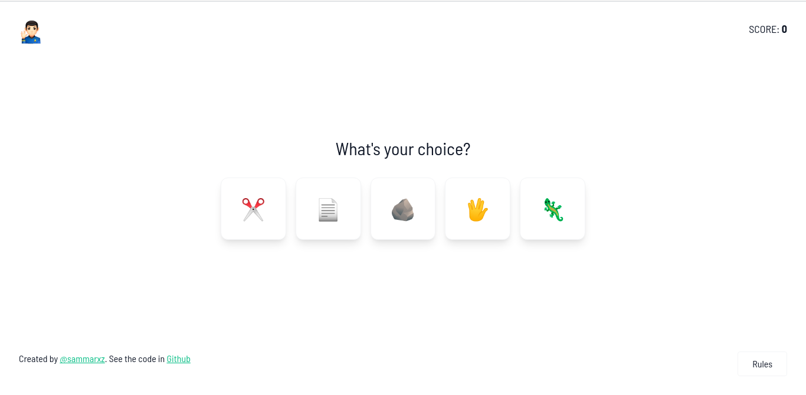

# BestJob Front-end Challenge
A new day. A new challenge. Here I took the challenge to try the job as a front-end developer for BestJob. The challenge was cool to be done. A classic game with a nerdy twist: "Rock Paper Scissors Lizard Spock" taken from the TV series: The Big Bang Theory. 

I wanted to make the game logic as separate as possible from the interface components, so I used ContextAPI with a hook. While the interface, I wanted to make it simple and functional, using emojis and tailwindcss to help me.
 
<br />


## How to run on localhost

First install dependencies:

```sh
yarn
```

To run in dev mode mode:

```sh
yarn start
```

Then go to http://localhost:8080

To create a production build:

```sh
npm run build
```

## Testing

To run unit tests:

```sh
yarn test
```

## Credits

Made with [createapp.dev](https://createapp.dev/)

